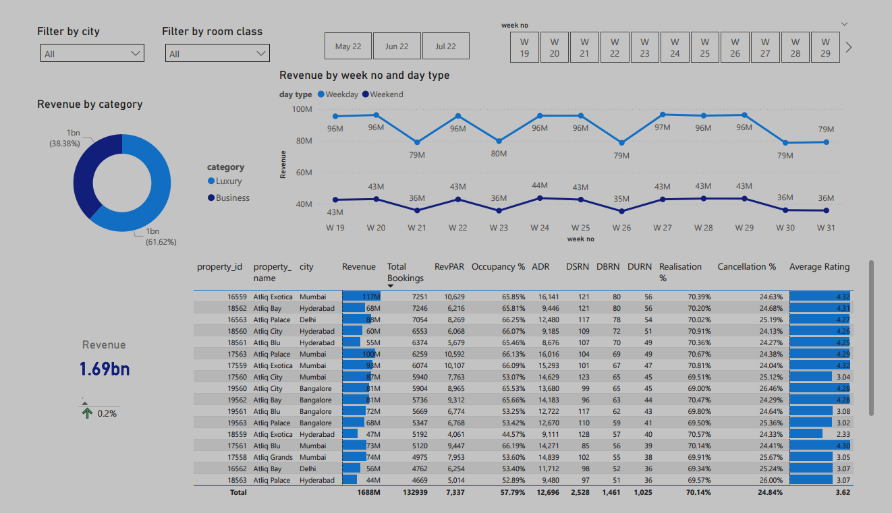

# 🏨 Hotel Booking Data Analysis with Power BI


---

## 📌 Project Overview
This project is a **Hotel Booking Data Analysis Dashboard** built in **Power BI**.  
It analyzes booking patterns, room utilization, revenue generation, and customer behavior over **May, June, and July** using **5 structured datasets**.

The dataset includes details about:
- Hotels and their categories
- Room types
- Bookings (both aggregated and individual)
- Customer ratings
- Revenue analysis

This project was designed to demonstrate **data modeling, DAX calculations, and interactive dashboard creation** skills.

---

## 📂 Dataset Information

The project uses **5 CSV files** as data sources:  

| File Name | Description |
|-----------|-------------|
| `dim_date` | Contains calendar details including date, month, week, and day type. |
| `dim_hotels` | Information about hotels including category and city. |
| `dim_rooms` | Mapping of room IDs to room classes. |
| `fact_aggregated_bookings` | Daily booking counts, capacities, and room types for each hotel. |
| `fact_bookings` | Individual booking-level details such as guests, revenue, and booking status. |

---

### 📊 Column Descriptions

<details>
<summary>Click to expand</summary>

#### **1️⃣ dim_date**
| Column | Description |
|--------|-------------|
| `date` | Dates for May, June, and July |
| `mmm yy` | Month and Year in `MMM YY` format |
| `week no` | Unique week number for the date |
| `day_type` | Weekend or Weekday |

#### **2️⃣ dim_hotels**
| Column | Description |
|--------|-------------|
| `property_id` | Unique hotel ID |
| `property_name` | Hotel name |
| `category` | Hotel class: Luxury / Business |
| `city` | City where the hotel is located |

#### **3️⃣ dim_rooms**
| Column | Description |
|--------|-------------|
| `room_id` | Room type ID (RT1–RT4) |
| `room_class` | Standard / Elite / Premium / Presidential |

#### **4️⃣ fact_aggregated_bookings**
| Column | Description |
|--------|-------------|
| `property_id` | Unique hotel ID |
| `check_in_date` | Customer check-in date |
| `room_category` | Room type (RT1–RT4) |
| `successful_bookings` | Successful bookings for that date & room type |
| `capacity` | Maximum available rooms for that date & room type |

#### **5️⃣ fact_bookings**
| Column | Description |
|--------|-------------|
| `booking_id` | Unique booking ID |
| `property_id` | Unique hotel ID |
| `booking_date` | Date of booking |
| `check_in_date` | Check-in date |
| `check_out_date` | Check-out date |
| `no_guests` | Number of guests |
| `room_category` | Room type (RT1–RT4) |
| `booking_platform` | Booking channel used |
| `ratings_given` | Customer rating |
| `booking_status` | Cancelled / Checked Out / No Show |
| `revenue_generated` | Total revenue from booking |
| `revenue_realized` | Final revenue after cancellations/refunds |

</details>

---

## 📈 Dashboard Features

✅ **KPIs and Metrics**:
- Occupancy Rate by Room Type & Hotel Category
- Revenue Trends (Generated vs Realized)
- Weekly & Monthly Booking Trends
- Cancellation and No-Show Impact

✅ **Interactive Filters**:
- Filter by Date, City, Hotel Category, Room Type
- Drill-down from month → week → day

✅ **Visuals**:
- Bar Charts, Line Charts, Pie Charts
- KPI Cards
- Slicers for dynamic filtering

✅ **DAX Measures Used**:
- Total Revenue, Revenue Realized
- Occupancy Percentage
- Average Rating per Hotel

---

## 🛠 Tools & Technologies

| Tool | Purpose |
|------|---------|
| **Power BI Desktop** | Data modeling, DAX calculations, visualization |
| **Microsoft Excel** | Dataset review & cleaning |
| **CSV Files** | Raw data source |
| **GitHub** | Project version control |

---

## 📷 Dashboard Preview

> 

---

## 📥 How to Use

1. **Clone the repository**  
   ```bash
   git clone https://github.com/ayushman075/Hospitality-Analysis.git
